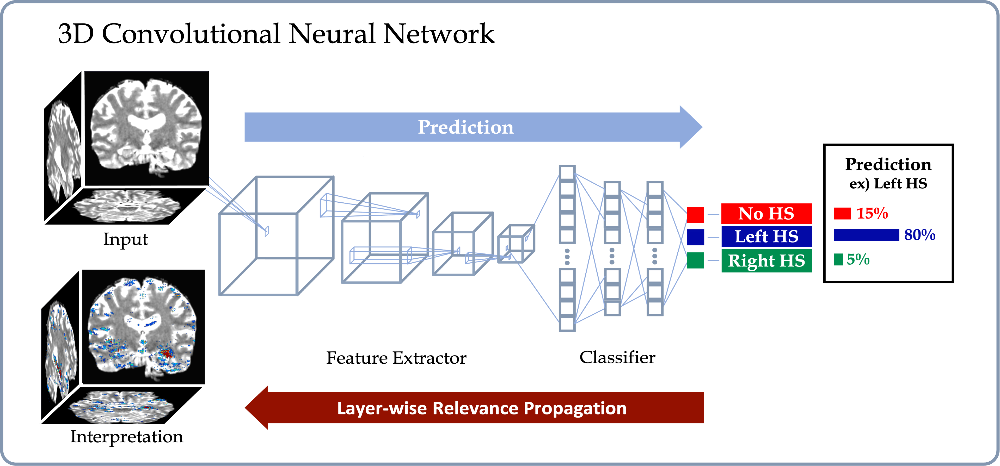
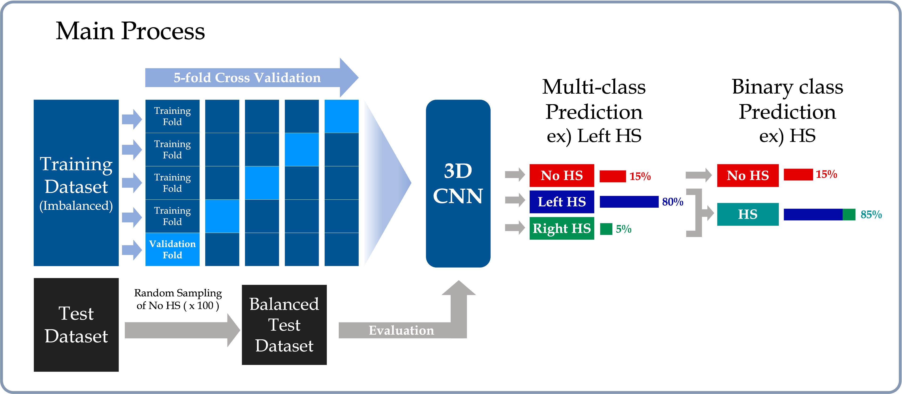
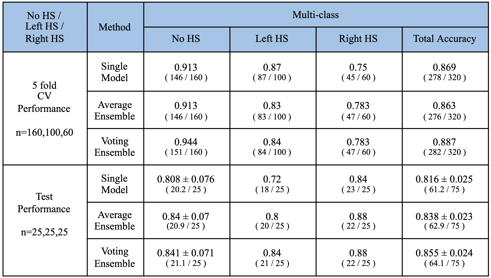
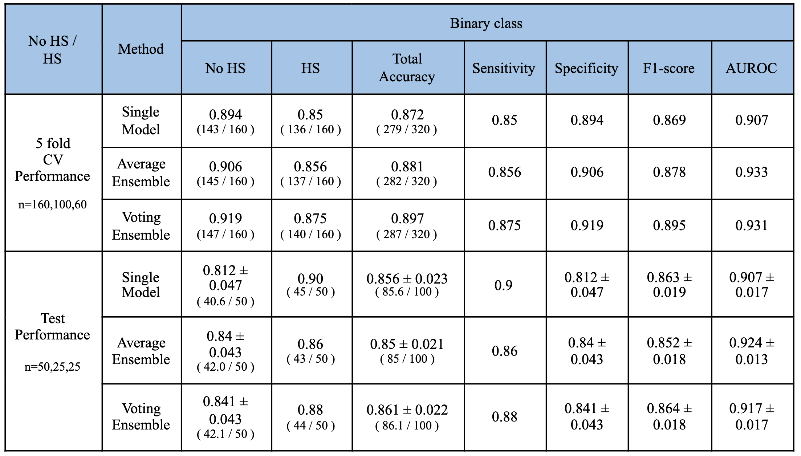
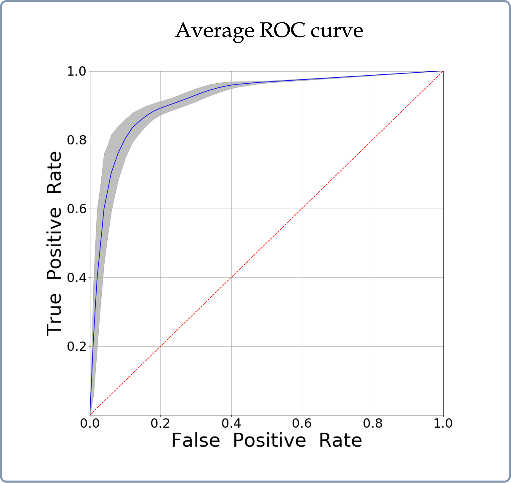
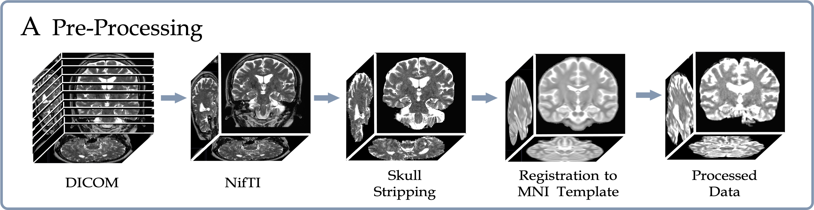

# Interpretable Deep Learning based Hippocampal Sclerosis Classification 


## Introduction

This repo contains Keras and PyTorch implementations of a deep learning framework that delineates interpretable Hippocampal Sclerosis(HS) prediction from Magnetic Resonance Imaging. We implemented a framework using a 3D convolutional neural network that was trained in an end to end fashion and generated an interpretation for the prediction through the Layerwise-relevance propagation method (Bach et al., 2015). See below. 

<p align="center">
   
</p>

The CNN model was developed on the HS dataset that was provided by the Seoul National University Hospital and evaluated through both 5-fold cross validation (CV) and using a separate balanced test dataset. By combining the prediction probabilities for the Left and Right HS classes and comparing it with the probability for the No HS class, we not only considered a multi-class classification setting, but also an easier binary classification setting in which the goal is to simply determine whether a person has HS or not.


<p align="center">
   
</p>

The training dataset was comprised 160 controls, 100 Left and 60 Right HS participants, and the test dataset was consisted of 252 control, 25 Left and 25 Right HS participants. Since the test dataset was imbalanced, we randomly sampled 25 and 50 participants from the control group 100 times to make a balanced test datasets for multi-class and binary classification. Since the test dataset was imbalanced, we randomly sampled 25 and 50 participants from the control group 100 times to make a balanced test datasets for multi-class and binary classification. We employed the average and voting ensemble methods to improve the prediction accuracy. For the test dataset, we plot the accuracies among several single models and their ensemble, and the average ROC curve of the Voting Ensemble method for the multi-class and binary classification settings, respectively.

<p align="center">
   
   
</p>

Once the model makes a prediction for a given individual 3D brain image, LRP recursively runs the relevance propagation step, which is similar to the standard back-propagation for neural networks training, to decompose and distribute the final prediction score to each input voxel. The decomposed score, dubbed as the relevance score, of LRP represents the importance of each voxel for the given prediction, and we obtain the saliency-map of the important voxels by visualizing the relevance scores higher than an appropriate threshold. We presented the interpretation both in individual and group-level.

<p align="center">
    
</p>

We applied a dimension reduction method called Uniform manifold approximation and projection (Mclnnes et al., 2018) to the output of the last convolutional layer in our 3D CNN. Figure 5 shows the projection of the feature embeddings to the two-dimensional space, and the solid circles and light triangles correspond to the training and test data samples, respectively.

<p align="center">
   
</p>


Please refer to our paper for more details. 

### Data

We trained, validated and tested the framework using the Hippocamapl Sclerosis (HS) dataset from the Seoul National University Hospital. To download the raw data, please contact those affiliations directly. We provided all data preprocessing manuscripts in "./Data_preprocessing/" folder. 

### Preprocessing

#### 1. Preprocessing steps for converting Dicom to Nifti format
  We used the [MRIcroGL](https://www.nitrc.org/projects/mricrogl) program to convert the MRI file in Dicom format to Nifti format 

#### 2. Preprocessing steps for Skull Stripping:

* **step1: Deoblique the data using AFNI 3drefit function** (need AFNI to be installed). 

    Fix up errors made when using to3d.
    ```
    3drefit -deoblique $entry
    ```
* **step2: Reorient the data using AFNI 3dresample function** (need AFNI to be installed). 

    Reorient the direction as same as the standard brain template to use.
    ```
    3dresample -orient LPI -prefix $LPI_image -inset $entry
    ```
* **step3: Bias field correction using AFNI 3dUnifize function** (need AFNI to be installed). 

    Remove the shading artifacts
    Approximately uniformized the white matter (WM) intensity across space and scaled to peak at about 1000.
    ```
    3dUnifize -input $LPI_image -prefix $BFcor_image -T2 -clfrac 0.3 -T2up 99.5
    ```
* **step4: Skull stripping using AFNI 3dSkullStrip and 3dcalc function** (need AFNI to be installed). 

    Generate a skull stripped mask and apply element-wise multiplication with the original input.
    Preserve not only the range of values of the brain but also some low-intensity voxels.
    ```
    3dSkullStrip -mask_vol -input $BFcor_image  -prefix $mask_image)
		3dcalc -a $BFcor_image -b $mask_image -expr 'a*step(b)' -prefix $SS_image
    ```

We provided this bash pipeline (Data_preprocessing/Preprocessing.sh) to perform this step :
```
bash Preprocessing.sh
```

#### 3. Registration onto [the standard brain template](http://www.bic.mni.mcgill.ca/~vfonov/icbm/2009/mni_icbm152_nlin_sym_09a_nifti.zip) using flirt function (need FSL to be installed):

    Register the skull stripped brain onto the the MNI brain template.
    Use flirt function (need FSL to be installed.)
    ```
    flirt -in $SS_image -ref zMNI_1x1x1_brain.nii.gz -out $image_MNI -omat $MNI_mat -dof 12
    ```
    
    We provided this bash pipeline (Data_preprocessing/Registration_MNI.sh) to perform this step :
    ```
    bash Registration_MNI.sh
    ```


* **step4: background removal** 
    
    Background signals outside the skull exist in the MRI. We set all background voxels with the same intensity (value=-1) to decrease the incluence of background signals. The general idea of doing background removal is using the Depth First Search with corners as starting points, then gradually filling out the searched background regions, until it reach outer bright sphere signals from skull fat. To run this step:
    
    ```
    python back_remove.py folder_for_prev_outcome_after_step123/ folder_for_final_output_of_step4/
    ```
    The background mask looks like below:
    
    
    To register all data in a folder, you can use the python script (Data_Preprocess/registration.py) in which calls the registration.sh.
    ```
    python registration.py folder_of_raw_data/ folder_for_processed_data/
    

#### 2. processing step for post-analysis on regional correlation between neuropath outcome and FCN prediction:
    
  * We performed subcortical segmentation using FreeSurfer (need to be installed) on those 11 FHS cases where neuropath data is available. To do the subcortical segmentation, you need to firstly do "recon-all" step using the freesurfer and then run the bash script below to get the final outcome: 
      ```
      bash segment_combine_label.sh
      ``` 

<p align="center">
   
</p>

### Code dependencies

The tool was developped based on the following packages:

1. PyTorch (1.1 or greater).
2. NumPy (1.16 or greater).
3. matplotlib (3.0.3 or greater)
4. tqdm (4.31 or greater).
5. FSL 

Please note that the dependencies may require Python 3.6 or greater. It is recommemded to install and maintain all packages by using [`conda`](https://www.anaconda.com/) or [`pip`](https://pypi.org/project/pip/). For the installation of GPU accelerated PyTorch, additional effort may be required. Please check the official websites of [PyTorch](https://pytorch.org/get-started/locally/) and [CUDA](https://developer.nvidia.com/cuda-downloads) for detailed instructions.


### Train, validate and test FCN and CNN models 

```
python main.py
```

In the main.py, run function 'fcn_main' will do number of repeat time indepentent FCN model training on random splitted data. Model performance is thus evaluated on all runs as mean +/- std. Disease probability maps will be automatically generated for each independent run in the following folders:

```
DPMs/fcn_exp0/
DPMs/fcn_exp1/
...
DPMs/fcn_expN/
```

Model weights and predicted raw scores on each subjects will be saved in:

```
ckeckpoint_dir/fcn_exp0/
ckeckpoint_dir/fcn_exp1/
...
ckeckpoint_dir/fcn_expN/
```

Similarly, run function 'cnn_main' will do number of repeat time indepentent CNN model training on random splitted data. Model performance is thus evaluated on all runs as mean +/- std. Results will be saved in the similiar way as FCN.  

### Train, validate and test MLP models 

```
python mlp_classifiers.py
```
Inside mlp_classifiers.py, various MLP models will be trained on different type of features, for more details, please see the comments in the script and refer to our paper. 


